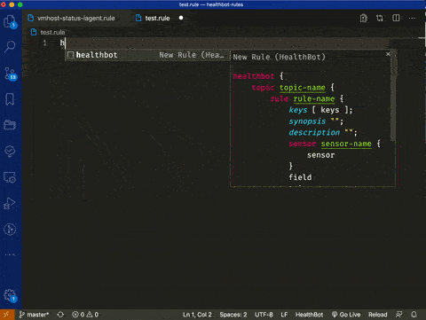

## Features

Syntax highlighting, auto completion and syntax validation or HealthBot rules and playbooks.

## Auto completion

## Syntax Validation

Syntax validation requires docker and an mgd docker image on the development
machine. You can configure the mgd image at `healthbot.mgd` workspace configuration.

After configuring the mgd image, save the file and invoke `Validate HealthBot Rule` command from command palette.

#### Limitations

Syntax validation works only when workspace is opened as a folder.